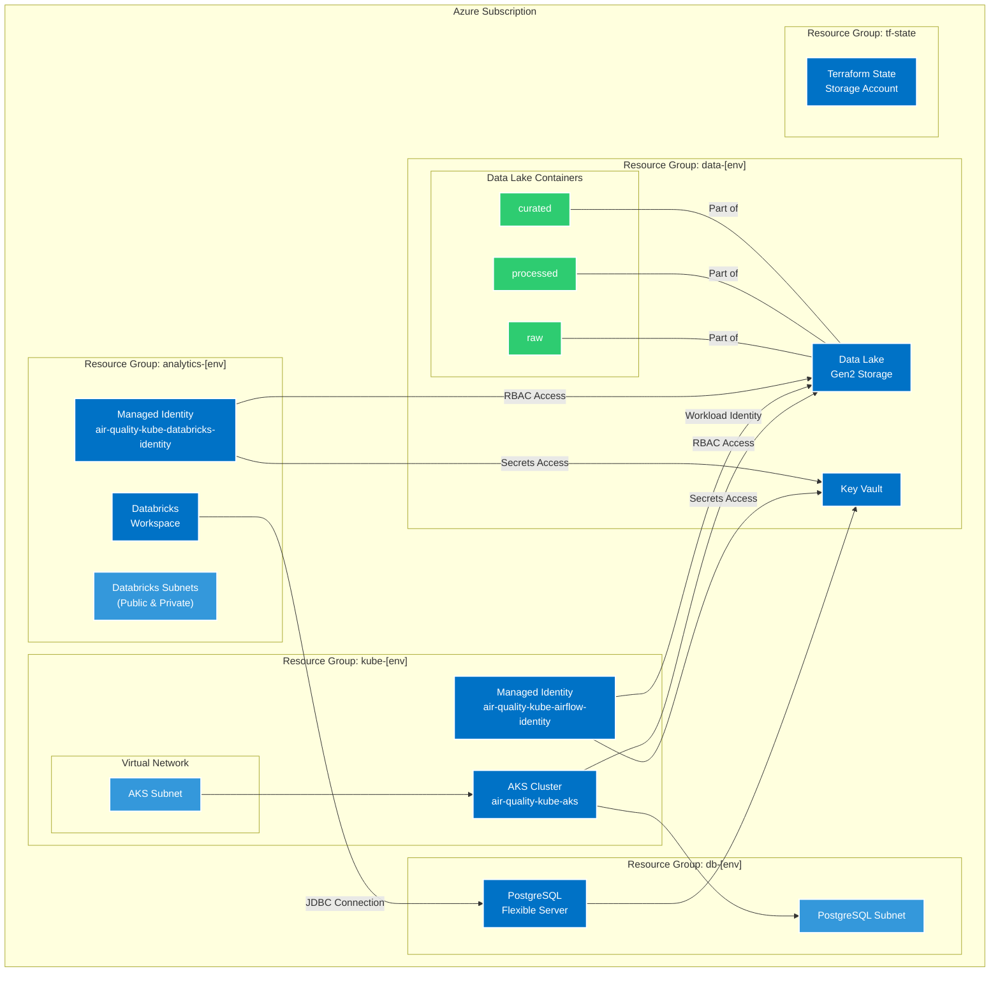
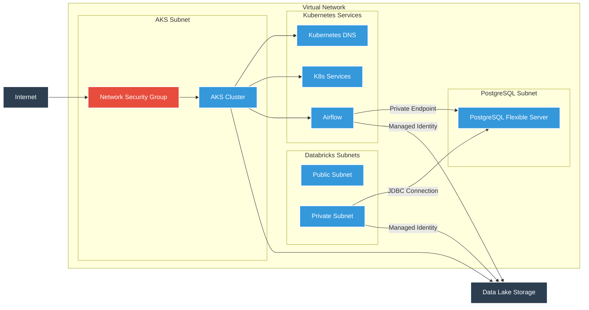
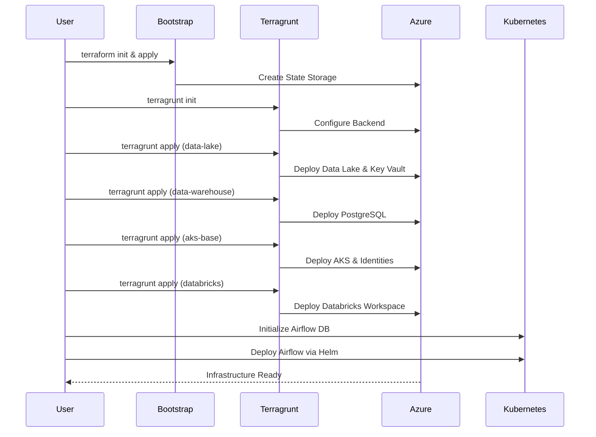

# Azure Air Quality Infrastructure

## Overview

This repository contains Infrastructure as Code (IaC) that deploys and manages a complete data platform for air quality monitoring on Azure. The platform consists of several key components:

- **Data Collection and Storage**: Azure Data Lake Storage Gen2 for raw, processed, and curated data layers
- **Data Processing**: Azure Kubernetes Service (AKS) running Apache Airflow for orchestration
- **Data Analytics**: Azure Databricks for advanced analytics and machine learning
- **Data Warehouse**: Azure PostgreSQL Flexible Server for structured data storage
- **Security**: Azure Key Vault for secrets management and Managed Identities for secure authentication

The infrastructure is implemented using Terraform modules with Terragrunt for environment management, enabling consistent deployment across development, staging, and production environments. The design follows Azure best practices with proper network isolation, RBAC permissions, and secrets management.

## Architecture Overview



### Network Architecture



## Infrastructure Deployment Flow



## Components

### AKS (Azure Kubernetes Service)
- Production-grade Kubernetes cluster running latest Kubernetes v1.30
- Auto-scaling enabled (1-3 nodes in dev, 2-20 nodes in prod)
- System node pool with D2s_v3 VMs (dev) or D4s_v3 VMs (prod)
- Azure CNI networking with Calico network policy
- Workload Identity enabled for secure Azure service access
- OIDC issuer for federated identity credentials

### Data Lake
- Azure Storage Account with Data Lake Gen2 capabilities
- Hierarchical Namespace enabled
- Three-tier data organization:
  - `raw` - Original, unmodified data
  - `processed` - Cleaned and transformed data
  - `curated` - Analysis-ready datasets

### Data Warehouse
- Azure PostgreSQL Flexible Server
- Private networking with no public access
- Secure connectivity through private endpoints
- Key Vault integration for secrets management
- Automatic backups and maintenance window configuration

### Databricks
- Azure Databricks workspace for data engineering and machine learning
- Custom VNet injection with public and private subnets
- Managed Identity for secure access to Data Lake
- Properly configured Network Security Groups

### Network Configuration
- Secure virtual network configuration with dedicated subnets
- Network security groups with restrictive rules
- Private endpoints for Azure services
- Service endpoints for secure service access
- Pod-level network policies in Kubernetes

### Security Features
- Azure RBAC enabled for all resources
- Network policies with Calico
- Private endpoints for Azure services
- Workload Identity for pod-level Azure authentication
- NSG rules for network security
- Key Vault for secrets management

### Apache Airflow
- Deployed using Helm chart
- Git-sync integration for DAGs
- PostgreSQL backend database
- Workload Identity integration for Azure resource access
- CeleryExecutor for scalable task processing

## Prerequisites

Before deploying this infrastructure, you'll need:

- **Local Development Environment**:
  - Azure CLI (version 2.50.0+) installed and configured
  - Terraform (version 1.5.0+)
  - Terragrunt (version 0.50.0+)
  - Helm (version 3.13.0+) 
  - kubectl (version 1.28.0+)
  - Git (version 2.39.0+)
  - Python (version 3.9+) for running initialization scripts

- **Azure Subscription Requirements**:
  - Contributor permissions on the Azure subscription
  - Service principal (if running in CI/CD) with Contributor permissions
  - Quota for required VM sizes (D2s_v3, D4s_v3)
  - Available regions that support all required services (PostgreSQL, AKS, Databricks)

- **Configuration Requirements**:
  - Git repository for storing Airflow DAGs (needed during Airflow deployment)
  - SSH keys or credentials for Git access (for Airflow DAG syncing)
  - Environment-specific configuration values (see Configuration section)

## Project Structure

```
.
├── terraform/
│   ├── modules/               # Reusable Terraform modules
│   │   ├── aks-base/          # AKS and networking infrastructure
│   │   ├── bootstrap/         # Initial state storage setup
│   │   ├── data-lake/         # Data Lake storage and Key Vault
│   │   ├── data-warehouse/    # PostgreSQL Flexible Server
│   │   └── databricks/        # Databricks workspace
│   ├── environments/          # Environment-specific configurations
│   │   ├── dev/
│   │   │   ├── aks-base/      # Dev AKS configuration
│   │   │   ├── data-lake/     # Dev Data Lake configuration
│   │   │   ├── data-warehouse/# Dev Data Warehouse configuration
│   │   │   ├── databricks/    # Dev Databricks configuration
│   │   │   ├── dev.hcl        # Dev environment variables
│   │   │   └── env.yaml       # Dev environment settings
│   │   ├── prod/              # Production environment (similar structure)
│   │   └── root.hcl           # Common Terragrunt configuration
│   └── shared_variables.hcl   # Shared variables across environments
├── helm/
│   └── airflow/               # Airflow Helm deployment
│       ├── airflow-values.yaml# Airflow Helm values
│       ├── deploy-airflow.sh  # Airflow deployment script
│       └── initialize-airflow-db.sh # Database initialization script
├── deploy.sh                  # Main deployment script
├── delete-everything.sh       # Cleanup script
├── export-subscription.sh     # Export subscription ID for Terraform
├── flatten-terraform.sh       # Helper script to view all Terraform code
└── README.md                  # This documentation
```

## Configuration Parameters

### Environment Configuration (env.yaml)

The following parameters can be configured in the environment-specific `env.yaml` file:

| Parameter   | Description                | Default (dev) | Default (prod) |
|-------------|----------------------------|--------------|----------------|
| environment | Environment name           | dev          | prod           |
| location    | Azure region for resources | westeurope   | westeurope     |
| prefix      | Resource name prefix       | air-quality-kube | air-quality-kube |

### AKS Configuration

| Parameter            | Description                   | Default (dev) | Default (prod) |
|----------------------|-------------------------------|--------------|----------------|
| kubernetes_version   | Kubernetes version            | 1.30         | 1.30           |
| node_count_min       | Minimum node count            | 1            | 2              |
| node_count_max       | Maximum node count            | 3            | 20             |
| node_size            | VM size for nodes             | Standard_D2s_v3 | Standard_D4s_v3 |
| os_disk_size_gb      | OS disk size in GB            | 128          | 128            |
| vnet_address_space   | VNET address space            | ["10.0.0.0/16"] | ["10.0.0.0/16"] |
| aks_subnet_address_prefix | AKS subnet CIDR          | ["10.0.1.0/24"] | ["10.0.1.0/24"] |
| service_cidr         | K8s service CIDR              | "172.16.0.0/16" | "172.16.0.0/16" |
| dns_service_ip       | K8s DNS service IP            | "172.16.0.10" | "172.16.0.10" |

### Data Lake Configuration

| Parameter                      | Description                 | Default         |
|--------------------------------|-----------------------------|-----------------|
| storage_account_tier           | Storage account tier        | "Standard"      |
| storage_account_replication_type | Replication strategy     | "LRS"           |
| data_lake_containers           | Data Lake containers        | ["raw", "processed", "curated"] |

### Data Warehouse Configuration

| Parameter                 | Description                    | Default        |
|---------------------------|--------------------------------|----------------|
| postgres_location         | PostgreSQL region              | "westeurope"   |
| postgres_sku_name         | PostgreSQL SKU                 | "B_Standard_B1ms" (dev) |
| postgres_version          | PostgreSQL version             | "15"           |
| postgres_storage_mb       | Storage in MB                  | 32768 (32GB)   |
| postgres_subnet_prefix    | PostgreSQL subnet CIDR         | ["10.0.2.0/24"] |
| enable_public_access      | Enable public network access   | false          |

### Databricks Configuration

| Parameter                         | Description                    | Default        |
|-----------------------------------|--------------------------------|----------------|
| sku                               | Databricks SKU                 | "standard"     |
| databricks_public_subnet_address_prefix | Public subnet CIDR      | ["10.0.3.0/24"] |
| databricks_private_subnet_address_prefix | Private subnet CIDR    | ["10.0.4.0/24"] |
| no_public_ip                      | Disable public IPs             | false (dev), true (prod) |

### Airflow Deployment Variables

The following environment variables are required for Airflow deployment (create a `.env-airflow` file):

| Variable             | Description                         | Default         |
|----------------------|-------------------------------------|-----------------|
| GIT_USERNAME         | Git username for DAG repo           | -               |
| GIT_PASSWORD         | Git password/token for DAG repo     | -               |
| GIT_REPO_URL         | URL to Git repo containing DAGs     | -               |
| AIRFLOW_NAME         | Name for Airflow Helm release       | "airflow"       |
| AIRFLOW_NAMESPACE    | Kubernetes namespace for Airflow    | "airflow"       |
| ENV                  | Environment name                    | "dev"           |

The following runtime variables are created in `.env-airflow-runtime-variables`:

| Variable               | Description                     | Auto-generated   |
|------------------------|---------------------------------|------------------|
| ENVIRONMENT            | Environment name                | Yes              |
| LOG_LEVEL              | Logging level                   | "info"           |
| ENERGY_DATA_URL        | URL for energy data source      | -                |
| DATA_LAKE_RESOURCE_GROUP | Resource group for Data Lake  | "air-quality-data-[env]" |
| PREFIX                 | Resource prefix                 | "air-quality-kube" |
| OPENAQ_API_KEY         | OpenAQ API key                  | -                |
| EIA_API_KEY            | Energy Information Admin API key| -                |
| DATA_LAKE_KEY          | Auto-generated Data Lake key    | Yes              |
| POSTGRES_HOST          | PostgreSQL hostname             | Yes              |
| POSTGRES_USER          | PostgreSQL username             | Yes              |
| POSTGRES_PASSWORD      | PostgreSQL password             | Yes              |
| POSTGRES_PORT          | PostgreSQL port                 | "5432"           |

## Installation and Setup

### 1. Initial Setup

```bash
# Clone the repository
git clone https://github.com/yourusername/azure-air-quality-infrastructure.git
cd azure-air-quality-infrastructure

# Login to Azure
az login
az account set --subscription "Your-Subscription-Name"

# Export subscription ID for Terraform
source ./export-subscription.sh

# Initialize backend storage
cd terraform/modules/bootstrap
terraform init
terraform apply -auto-approve
cd ../../..
```

### 2. Environment Configuration

Update the environment configuration in `terraform/environments/dev/env.yaml` or create a new environment:

```yaml
environment: dev
location: westeurope
prefix: air-quality-kube
```

### 3. Deploy Complete Infrastructure

Use the provided deployment script to set up the entire infrastructure:

```bash
# Execute the deploy script for development environment
./deploy.sh --environment dev

# For production
./deploy.sh --environment prod --delete-warehouse
```

The script will deploy the following components in order:
1. Bootstrap (if not already deployed)
2. Data Lake and Key Vault
3. AKS Cluster with networking
4. PostgreSQL Flexible Server
5. Databricks workspace
6. Airflow database initialization
7. Airflow using Helm

#### 4. Manual Step-by-Step Deployment

For step-by-step manual deployment or understanding each component:

```bash
# Export subscription ID for Terraform
source ./export-subscription.sh

# Deploy Data Lake
cd terraform/environments/dev/data-lake
terragrunt init
terragrunt apply

# Deploy AKS
cd ../aks-base
terragrunt init
terragrunt apply

# Deploy Data Warehouse
cd ../data-warehouse
terragrunt init
terragrunt apply

# Deploy Databricks
cd ../databricks
terragrunt init
terragrunt apply

# Get Kubernetes credentials
az aks get-credentials --resource-group air-quality-kube-dev --name air-quality-kube-aks --overwrite-existing

# Initialize Airflow database
cd ../../../helm/airflow
./initialize-airflow-db.sh

# Set up Airflow environment variables
cat > .env-airflow << EOL
GIT_USERNAME=your-git-username
GIT_PASSWORD=your-git-token
GIT_REPO_URL=https://github.com/yourusername/airflow-dags.git
AIRFLOW_NAME=airflow
AIRFLOW_NAMESPACE=airflow
ENV=dev
AIRFLOW_ADMIN_USER=admin
AIRFLOW_ADMIN_PASSWORD=admin-password
AIRFLOW_ADMIN_EMAIL=admin@example.com
EOL

# Create runtime variables
cat > .env-airflow-runtime-variables << EOL
ENVIRONMENT=dev
LOG_LEVEL=info
ENERGY_DATA_URL=https://example.com/energy-data
DATA_LAKE_RESOURCE_GROUP=air-quality-data-dev
PREFIX=air-quality-kube
OPENAQ_API_KEY=your-openaq-api-key
EIA_API=your-eia-api-key
DATA_LAKE_KEY=
POSTGRES_PORT=5432
EOL

# Get Data Lake key
./get-data-lake-key.sh

# Deploy Airflow
./deploy-airflow.sh

cd ../..
```

## Module Configuration Reference

### AKS Base Module (`terraform/modules/aks-base`)

This module deploys the AKS cluster and associated networking components.

**Key configurations:**
- `kubernetes_version`: Kubernetes version (default: "1.30")
- `node_count_min`: Minimum nodes for autoscaling (default: 1 for dev, 2 for prod)
- `node_count_max`: Maximum nodes for autoscaling (default: 3 for dev, 20 for prod)
- `node_size`: VM size for nodes (default: "Standard_D2s_v3" for dev, "Standard_D4s_v3" for prod)
- `os_disk_size_gb`: OS disk size in GB (default: 128)
- `vnet_address_space`: VNET address space (default: ["10.0.0.0/16"])
- `aks_subnet_address_prefix`: AKS subnet CIDR (default: ["10.0.1.0/24"])

The module creates:
- Resource group for AKS resources
- Virtual network and subnet
- AKS cluster with system node pool
- Managed Identity for Airflow
- RBAC role assignments for Data Lake access
- Federated Identity Credential for Workload Identity

### Data Lake Module (`terraform/modules/data-lake`)

This module deploys the Data Lake storage and Key Vault.

**Key configurations:**
- `storage_account_tier`: Storage account performance tier (default: "Standard")
- `storage_account_replication_type`: Data replication strategy (default: "LRS")
- `data_lake_containers`: List of containers to create (default: ["raw", "processed", "curated"])

The module creates:
- Resource group for data resources
- Storage Account with Data Lake Gen2 capabilities
- Storage containers
- Key Vault with RBAC authorization

### Data Warehouse Module (`terraform/modules/data-warehouse`)

This module deploys the PostgreSQL Flexible Server.

**Key configurations:**
- `postgres_location`: PostgreSQL server location (default: "westeurope")
- `postgres_sku_name`: PostgreSQL SKU tier (default: "B_Standard_B1ms")
- `postgres_version`: PostgreSQL version (default: "15")
- `postgres_storage_mb`: Storage in MB (default: 32768)
- `postgres_subnet_prefix`: Subnet CIDR for PostgreSQL (default: ["10.0.2.0/24"])
- `enable_public_access`: Control public network access (default: false)

The module creates:
- Resource group for database resources
- Private DNS Zone for PostgreSQL
- Subnet for PostgreSQL with delegation
- PostgreSQL Flexible Server
- Firewall rules to allow access from AKS
- Secrets in Key Vault for database credentials

### Databricks Module (`terraform/modules/databricks`)

This module deploys the Databricks workspace.

**Key configurations:**
- `sku`: Databricks SKU (default: "standard")
- `databricks_public_subnet_address_prefix`: Public subnet CIDR (default: ["10.0.3.0/24"])
- `databricks_private_subnet_address_prefix`: Private subnet CIDR (default: ["10.0.4.0/24"])
- `no_public_ip`: Disable public IPs (default: false for dev, true for prod)

The module creates:
- Resource group for analytics resources
- Databricks workspace with VNet injection
- Public and private subnets for Databricks
- Network Security Group for Databricks
- Managed Identity for Databricks
- RBAC role assignments for Data Lake access

## Operations Guide

### Accessing AKS Cluster

```bash
# Get AKS credentials
az aks get-credentials --resource-group air-quality-kube-dev --name air-quality-kube-aks

# Verify connection
kubectl cluster-info
```

### Accessing Airflow UI

```bash
# Port-forward to Airflow webserver
kubectl port-forward svc/airflow-web 8080:8080 -n airflow

# Access the UI at: http://localhost:8080
# Get credentials from Key Vault:
az keyvault secret show --vault-name "airqualitykubedbkvdev" --name "airflow-admin-user" --query value -o tsv
az keyvault secret show --vault-name "airqualitykubedbkvdev" --name "airflow-admin-password" --query value -o tsv
```

### Accessing Databricks Workspace

```bash
# Get Databricks workspace URL
az databricks workspace show --resource-group air-quality-analytics-dev --name air-quality-kube-databricks-dev --query workspaceUrl -o tsv

# Access via the Azure Portal or direct URL: https://<workspace-url>.azuredatabricks.net
```

### Managing Data Lake Access

```bash
# List containers
az storage container list --account-name $(az storage account list --resource-group air-quality-data-dev --query "[0].name" -o tsv)

# Grant access to a user/service principal
az role assignment create \
    --role "Storage Blob Data Contributor" \
    --assignee [user-or-sp-id] \
    --scope [storage-account-id]
```

### Connecting to PostgreSQL

```bash
# Get PostgreSQL connection details
PGHOST=$(az keyvault secret show --vault-name "airqualitykubedbkvdev" --name "airflow-postgres-host" --query value -o tsv)
PGUSER=$(az keyvault secret show --vault-name "airqualitykubedbkvdev" --name "airflow-postgres-user" --query value -o tsv)
PGPASSWORD=$(az keyvault secret show --vault-name "airqualitykubedbkvdev" --name "airflow-postgres-password" --query value -o tsv)

# Connect from within AKS (create a temporary pod)
kubectl run pg-client --image=postgres:13 -it --rm --restart=Never -- \
  /bin/bash -c "PGPASSWORD=$PGPASSWORD psql -h $PGHOST -U $PGUSER -d airflow"
```

## Maintenance and Updates

### Updating Kubernetes Version

1. Update the `kubernetes_version` in `terraform/environments/dev/aks-base/terragrunt.hcl`
2. Run `terragrunt plan` to verify changes
3. Apply the update: `terragrunt apply`

### Adding New Environments

1. Copy the `dev` directory structure
```bash
cp -r terraform/environments/dev terraform/environments/staging
```
2. Update environment-specific configurations in `staging/env.yaml`
3. Update any environment-specific overrides in `staging.hcl`
4. Deploy using `./deploy.sh --environment staging`

### Updating Airflow

1. Update the Airflow image version in `helm/airflow/airflow-values.yaml`
2. Redeploy Airflow:
```bash
cd helm/airflow
./deploy-airflow.sh
```

### Clean Up Resources

To delete all resources created by this infrastructure:

```bash
# WARNING: This will delete EVERYTHING in the subscription
./delete-everything.sh
```

## Integration Points

The infrastructure provides the following integration points with other systems:

### External Data Sources
- **OpenAQ API**: Configured in Airflow via OPENAQ_API_KEY environment variable
- **Energy Information Administration (EIA) API**: Configured in Airflow via EIA_API_KEY environment variable
- **Custom Energy Data Source**: Configured in Airflow via ENERGY_DATA_URL environment variable

### Git Integration
- **DAG Repository**: Airflow is configured to sync DAGs from a Git repository
- **Authentication**: Uses username/password or token authentication for Git access

### Azure Services Integration
- **Azure Monitor**: AKS, PostgreSQL, and Databricks are configured to send logs and metrics to Azure Monitor
- **Azure Active Directory**: Integration for identity management
- **Azure RBAC**: Used for permissions management across all resources

## Troubleshooting

### Terraform/Terragrunt Issues

1. **Terragrunt initialization fails**
   - Verify Azure credentials with `az account show`
   - Check if state storage exists: `az storage account show --name aqtfstatedev --resource-group terraform-state-dev`
   - Ensure correct subscription is selected with `az account set --subscription "Your-Subscription-Name"`
   - Check if Terraform state is locked: `az storage blob show --container-name tfstate --name "terraform.tfstate.tflock" --account-name aqtfstatedev`

2. **Resource quota limits exceeded**
   - Check your subscription quotas in Azure Portal
   - Request quota increase for VM sizes or services as needed
   - Use `az vm list-usage --location westeurope` to check VM quota usage

### AKS Issues

1. **AKS deployment fails**
   - Check VNET and subnet availability: `az network vnet list`
   - Verify service principal permissions
   - Check for regional outages: [Azure Status](https://status.azure.com)

2. **Unable to connect to AKS**
   - Refresh credentials: `az aks get-credentials --resource-group air-quality-kube-dev --name air-quality-kube-aks --overwrite-existing`
   - Check if the cluster is running: `az aks show --resource-group air-quality-kube-dev --name air-quality-kube-aks --query provisioningState`

### PostgreSQL Issues

1. **PostgreSQL connectivity issues**
   - Verify network security rules and private endpoints
   - Check private DNS zone configuration
   - Run test connection pod in AKS:
     ```bash
     kubectl run pg-test --image=postgres:13 -it --rm --restart=Never -- \
       /bin/bash -c "apt-get update && apt-get install -y dnsutils && nslookup air-quality-kube-airflow-pg-dev.postgres.database.azure.com"
     ```

2. **Database initialization fails**
   - Check PostgreSQL server status: `az postgres flexible-server show --name air-quality-kube-airflow-pg-dev --resource-group air-quality-db-dev`
   - Check credentials in Key Vault
   - Examine initialization pod logs: `kubectl logs airflow-db-init`

### Airflow Deployment Issues

1. **Airflow pods not starting**
   - Check pod status: `kubectl get pods -n airflow`
   - Examine pod logs: `kubectl logs -n airflow <pod-name>`
   - Verify secrets exist: `kubectl get secrets -n airflow`

2. **Git sync not working**
   - Verify Git credentials
   - Check git-sync container logs: `kubectl logs -n airflow <scheduler-pod-name> -c git-sync`
   - Test Git repo accessibility

3. **Workload Identity issues**
   - Verify federated credential is set up correctly: `az identity federated-credential list --identity-name air-quality-kube-airflow-identity --resource-group air-quality-kube-dev`
   - Check service account: `kubectl get serviceaccount airflow-service-account -n airflow`

## Security Considerations

### Network Security
- All PostgreSQL databases are accessible only via private endpoints
- AKS uses Azure CNI with network policies enabled
- NSGs are applied to all subnets with least-privilege rules
- No public IP access for sensitive services by default

### Identity and Access Management
- Managed Identities are used instead of service principals where possible
- Workload Identity Federation is used for Kubernetes pod authentication
- RBAC is applied across all Azure resources with least-privilege principle
- Key Vault uses RBAC for access control to secrets

### Data Protection
- Data Lake has hierarchical namespace with proper RBAC
- Data is organized in containers with appropriate access control
- Private endpoints are used for secure communication
- Backup policies are enabled for critical services

### Compliance Best Practices
1. **Regularly Update**:
   - Keep Kubernetes version up to date
   - Apply security patches to all components
   - Regularly rotate secrets and credentials

2. **Monitor**:
   - Enable diagnostic logs
   - Set up alerts for suspicious activities
   - Implement Azure Security Center recommendations

3. **Audit**:
   - Enable Azure Activity Logs
   - Implement resource locks on production resources
   - Regularly review access controls and permissions

## Contributing

1. Fork the repository
2. Create a feature branch
```bash
git checkout -b feature/your-feature-name
```
3. Make your changes following the coding standards
4. Run security and linting checks
```bash
# Check Terraform formatting
terraform fmt -recursive

# Validate Terraform configuration
cd terraform/environments/dev/aks-base
terragrunt validate
```
5. Submit a pull request with a detailed description of changes
6. Ensure CI pipeline passes all checks

### Coding Standards
- Use snake_case for resource names
- Include descriptive comments for complex logic
- Follow [Terraform best practices](https://cloud.hashicorp.com/products/terraform/tutorials/best-practices)
- Use consistent indentation (2 spaces)
- Include meaningful variable descriptions
- Always specify explicit versions for providers
