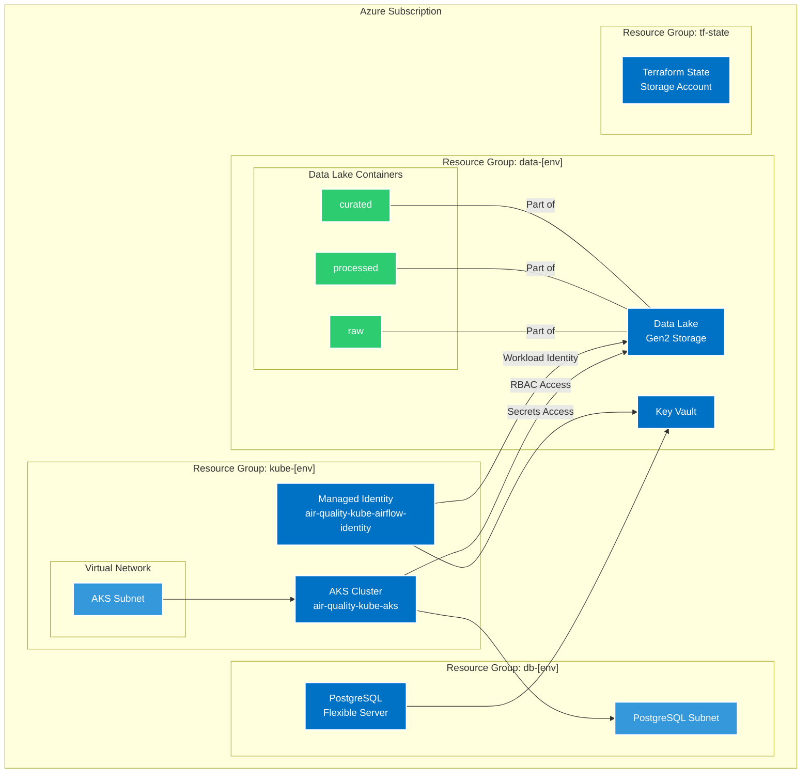
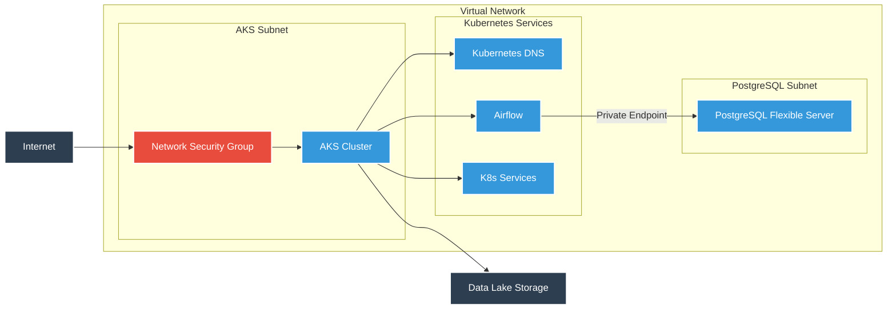
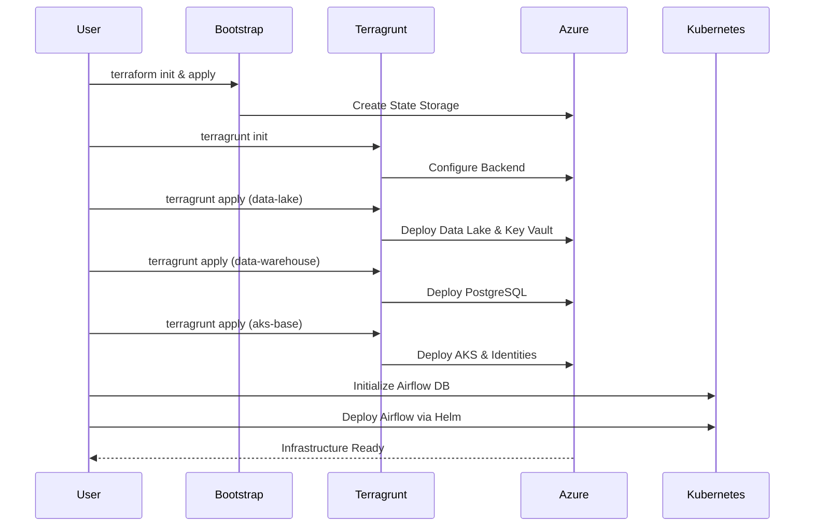

# Azure Air Quality Infrastructure

## Overview

This repository contains the Infrastructure as Code (IaC) implementation for the Air Quality monitoring platform on Azure. The infrastructure is managed using Terraform and Terragrunt, providing a scalable, maintainable, and environment-agnostic approach to infrastructure deployment.

## Architecture Overview



## Network Architecture



## Infrastructure Deployment Flow



## Components

### AKS (Azure Kubernetes Service)
- Production-grade Kubernetes cluster running latest Kubernetes v1.30
- Auto-scaling enabled (2-20 nodes)
- System node pool with D4s_v3 VMs
- Azure CNI networking with Calico network policy
- Workload Identity enabled for secure Azure service access
- OIDC issuer for federated identity credentials

### Data Lake
- Azure Storage Account with Data Lake Gen2 capabilities
- Hierarchical Namespace enabled
- Three-tier data organization:
  - `raw` - Original, unmodified data
  - `processed` - Cleaned and transformed data
  - `curated` - Analysis-ready datasets

### Data Warehouse
- Azure PostgreSQL Flexible Server
- Private networking with no public access
- Secure connectivity through private endpoints
- Key Vault integration for secrets management
- Automatic backups and maintenance window configuration

### Network Configuration
- Secure virtual network configuration with dedicated subnets
- Network security groups with restrictive rules
- Private endpoints for Azure services
- Service endpoints for secure service access
- Pod-level network policies in Kubernetes

### Security Features
- Azure RBAC enabled for all resources
- Network policies with Calico
- Private endpoints for Azure services
- Workload Identity for pod-level Azure authentication
- NSG rules for network security
- Key Vault for secrets management

### Apache Airflow
- Deployed using Helm chart
- Git-sync integration for DAGs
- PostgreSQL backend database
- Workload Identity integration for Azure resource access
- CeleryExecutor for scalable task processing

## Prerequisites

- Azure CLI installed and configured (version 2.40.0+)
- Terraform >= 1.0.0
- Terragrunt >= 0.45.0
- Helm >= 3.10.0
- kubectl >= 1.26.0
- Azure subscription with contributor permissions
- Git

## Project Structure

```
.
├── terraform/
│   ├── modules/               # Reusable Terraform modules
│   │   ├── aks-base/          # AKS and networking infrastructure
│   │   ├── bootstrap/         # Initial state storage setup
│   │   ├── data-lake/         # Data Lake storage and Key Vault
│   │   └── data-warehouse/    # PostgreSQL Flexible Server
│   ├── environments/          # Environment-specific configurations
│   │   ├── dev/
│   │   │   ├── aks-base/      # Dev AKS configuration
│   │   │   ├── data-lake/     # Dev Data Lake configuration
│   │   │   ├── data-warehouse/# Dev Data Warehouse configuration
│   │   │   ├── dev.hcl        # Dev environment variables
│   │   │   └── env.yaml       # Dev environment settings
│   │   ├── prod/              # Production environment (similar structure)
│   │   └── root.hcl           # Common Terragrunt configuration
│   └── shared_variables.hcl   # Shared variables across environments
├── helm/
│   └── airflow/               # Airflow Helm deployment
│       ├── airflow-values.yaml# Airflow Helm values
│       ├── deploy-airflow.sh  # Airflow deployment script
│       └── initialize-airflow-db.sh # Database initialization script
├── deploy.sh                  # Main deployment script
├── delete-everything.sh       # Cleanup script
└── README.md                  # This documentation
```

## Installation and Setup

### 1. Initial Setup

```bash
# Clone the repository
git clone https://github.com/yourusername/azure-air-quality-infrastructure.git
cd azure-air-quality-infrastructure

# Login to Azure
az login
az account set --subscription "Your-Subscription-Name"

# Initialize backend storage
cd terraform/modules/bootstrap
terraform init
terraform apply
```

### 2. Environment Configuration

You can customize the environment by updating the environment configuration in `terraform/environments/dev/env.yaml`:

```yaml
environment: dev
location: westeurope
prefix: air-quality-kube
```

### 3. Deploy Infrastructure

Use the provided deployment script to set up the entire infrastructure:

```bash
# Execute the deploy script for development environment
./deploy.sh --environment dev

# For production
./deploy.sh --environment prod
```

The script will deploy the following components in order:
1. Bootstrap (if not already deployed)
2. Data Lake and Key Vault
3. PostgreSQL Flexible Server
4. AKS Cluster with networking
5. Airflow database initialization
6. Airflow using Helm

#### Manual Deployment

For step-by-step manual deployment:

```bash
# Deploy Data Lake
cd terraform/environments/dev/data-lake
terragrunt init
terragrunt apply

# Deploy Data Warehouse
cd ../data-warehouse
terragrunt init
terragrunt apply

# Deploy AKS
cd ../aks-base
terragrunt init
terragrunt apply

# Initialize Airflow database
cd ../../../helm/airflow
./initialize-airflow-db.sh

# Deploy Airflow
./deploy-airflow.sh
```

## Module Configurations

### AKS Base Module (`terraform/modules/aks-base`)

Key configurations available:
- `kubernetes_version`: Kubernetes version (default: "1.30")
- `node_count_min`: Minimum nodes for autoscaling (default: 2)
- `node_count_max`: Maximum nodes for autoscaling (default: 20)
- `node_size`: VM size for nodes (default: "Standard_D4s_v3")
- `os_disk_size_gb`: OS disk size in GB (default: 128)
- `vnet_address_space`: VNET address space (default: ["10.0.0.0/16"])
- `aks_subnet_address_prefix`: AKS subnet CIDR (default: ["10.0.1.0/24"])

### Data Lake Module (`terraform/modules/data-lake`)

Key configurations available:
- `storage_account_tier`: Storage account performance tier (default: "Standard")
- `storage_account_replication_type`: Data replication strategy (default: "LRS")
- `data_lake_containers`: List of containers to create (default: ["raw", "processed", "curated"])

### Data Warehouse Module (`terraform/modules/data-warehouse`)

Key configurations available:
- `postgres_location`: PostgreSQL server location (default: "westeurope")
- `postgres_sku_name`: PostgreSQL SKU tier (default: "B_Standard_B1ms")
- `postgres_version`: PostgreSQL version (default: "15")
- `postgres_storage_mb`: Storage in MB (default: 32768)
- `postgres_subnet_prefix`: Subnet CIDR for PostgreSQL (default: ["10.0.2.0/24"])
- `enable_public_access`: Control public network access (default: false)

## Operations Guide

### Accessing AKS Cluster

```bash
# Get AKS credentials
az aks get-credentials --resource-group air-quality-kube-dev --name air-quality-kube-aks

# Verify connection
kubectl cluster-info
```

### Accessing Airflow UI

```bash
# Port-forward to Airflow webserver
kubectl port-forward svc/airflow-web 8080:8080 -n airflow

# Access the UI at: http://localhost:8080
# Default credentials can be retrieved from Key Vault:
az keyvault secret show --vault-name "airqualitykubedbkvdev" --name "airflow-admin-user" --query value -o tsv
az keyvault secret show --vault-name "airqualitykubedbkvdev" --name "airflow-admin-password" --query value -o tsv
```

### Managing Data Lake Access

```bash
# List containers
az storage container list --account-name $(az storage account list --resource-group air-quality-data-dev --query "[0].name" -o tsv)

# Grant access to a user/service principal
az role assignment create \
    --role "Storage Blob Data Contributor" \
    --assignee [user-or-sp-id] \
    --scope [storage-account-id]
```

## Maintenance and Updates

### Updating Kubernetes Version

1. Update the `kubernetes_version` in `terraform/environments/dev/aks-base/terragrunt.hcl`
2. Run `terragrunt plan` to verify changes
3. Apply the update: `terragrunt apply`

### Adding New Environments

1. Copy the `dev` directory structure
2. Update environment-specific configurations
3. Create new environment file (e.g., `prod.hcl`)
4. Update variables in `env.yaml`

### Clean Up Resources

To delete all resources created by this infrastructure:

```bash
# WARNING: This will delete EVERYTHING in the subscription
./delete-everything.sh
```

## Troubleshooting

Common issues and solutions:

1. **Terragrunt initialization fails**
   - Verify Azure credentials
   - Check storage account access
   - Ensure correct subscription is selected

2. **AKS deployment fails**
   - Verify VNET and subnet availability
   - Check resource quota limits
   - Ensure proper RBAC permissions

3. **PostgreSQL connectivity issues**
   - Verify network security rules
   - Check DNS zone links
   - Ensure subnet delegation is properly configured

4. **Airflow deployment issues**
   - Check PostgreSQL credentials in Key Vault
   - Verify Kubernetes workload identity setup
   - Examine pod logs with `kubectl logs -n airflow <pod-name>`

## Security Considerations

- All sensitive data is stored in Azure Key Vault
- Managed identities are used for service authentication
- Private networking is implemented for PostgreSQL
- RBAC is used for fine-grained access control
- Network security groups restrict traffic
- Workload Identity provides secure access from pods to Azure services
- Regular Kubernetes version updates should be applied
- All communication happens over private networks where possible

## Contributing

1. Fork the repository
2. Create a feature branch
3. Make your changes
4. Submit a pull request with a detailed description of changes

## License

This project is licensed under the MIT License - see the LICENSE file for details.

## Support

For issues and feature requests, please create an issue in the repository.
