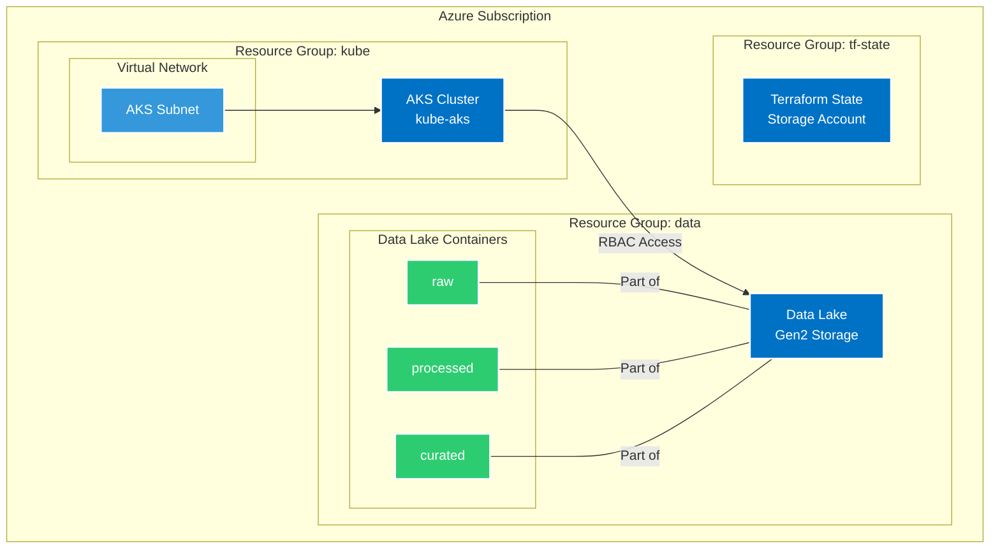
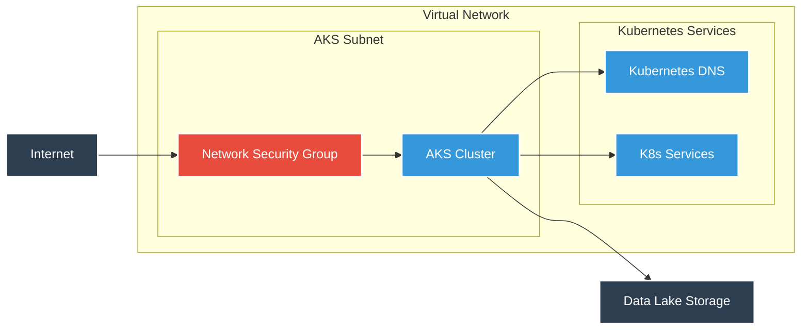
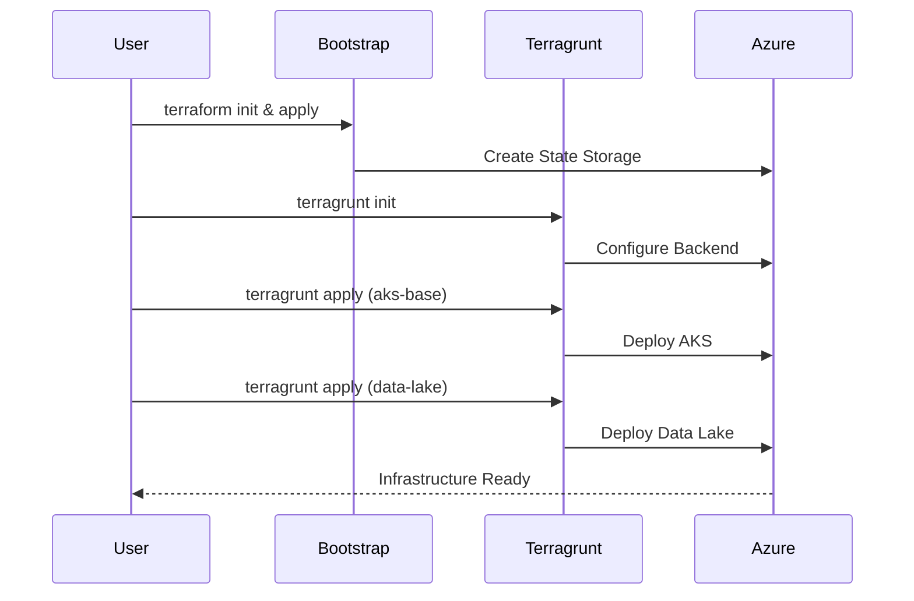

# Azure Air Quality Infrastructure

## Overview

This repository contains the Infrastructure as Code (IaC) implementation for the Air Quality monitoring platform on Azure. The infrastructure is managed using Terraform and Terragrunt, providing a scalable, maintainable, and environment-agnostic approach to infrastructure deployment.

## Architecture Overview



## Network Architecture



## Infrastructure Deployment Flow



## Components

### AKS (Azure Kubernetes Service)
- Production-grade Kubernetes cluster
- Auto-scaling enabled (1-5 nodes)
- System node pool with Ubuntu OS
- Azure CNI networking with Calico network policy
- Workload Identity enabled for secure Azure service access

### Data Lake
- Azure Storage Account with Data Lake Gen2 capabilities
- Hierarchical Namespace enabled
- Three-tier data organization:
  - `raw` - Original, unmodified data
  - `processed` - Cleaned and transformed data
  - `curated` - Analysis-ready datasets

### Network Configuration
- Secure virtual network configuration with dedicated subnets
- Network security groups with restrictive rules
- Private endpoints for Azure services
- Service endpoints for secure service access
- Pod-level network policies in Kubernetes

**Note:** Network configuration details are environment-specific and can be found in the deployment configuration files.

### Security Features
- Azure RBAC enabled
- Network policies with Calico
- Private endpoints for Azure services
- Workload Identity for pod-level Azure authentication
- NSG rules for network security

## Prerequisites

- Azure CLI installed and configured
- Terraform >= 1.0.0
- Terragrunt >= 0.45.0
- Azure subscription with necessary permissions
- Git

## Project Structure

```
terraform/
├── bootstrap/              # Initial state storage setup
│   └── main.tf
├── environments/           # Environment-specific configurations
│   ├── dev/
│   │   ├── aks-base/
│   │   │   └── terragrunt.hcl
│   │   ├── data-lake/
│   │   │   └── terragrunt.hcl
│   │   ├── dev.hcl
│   │   └── env.yaml
│   └── root.hcl
└── modules/               # Reusable Terraform modules
    ├── aks-base/
    │   ├── main.tf
    │   ├── variables.tf
    │   └── outputs.tf
    └── data-lake/
        ├── main.tf
        ├── variables.tf
        └── outputs.tf
```

## Installation and Setup

### 1. Initial Setup

```bash
# Clone the repository
git clone [repository-url]
cd [repository-name]

# Login to Azure
az login
az account set --subscription "Your-Subscription-Name"

# Initialize backend storage
cd bootstrap
terraform init
terraform apply
```

### 2. Environment Configuration

Update the environment configuration in `environments/dev/env.yaml`:

```yaml
environment: dev
location: italynorth
prefix: air-quality-kube
```

### 3. Deploy Infrastructure

```bash
# Deploy AKS
cd environments/dev/aks-base
terragrunt init
terragrunt apply

# Deploy Data Lake
cd ../data-lake
terragrunt init
terragrunt apply
```

## Module Configurations

### AKS Base Module

Key configurations available:
- `kubernetes_version`: Kubernetes version (default: "1.27")
- `node_count`: Initial number of nodes (default: 2)
- `node_count_min`: Minimum nodes for autoscaling (default: 1)
- `node_count_max`: Maximum nodes for autoscaling (default: 5)
- `node_size`: VM size for nodes (default: "Standard_D2s_v3")

### Data Lake Module

Key configurations available:
- `storage_account_tier`: Storage account performance tier
- `storage_account_replication_type`: Data replication strategy
- `data_lake_containers`: List of containers to create

## Operations Guide

### Accessing AKS Cluster

```bash
# Get AKS credentials
az aks get-credentials --resource-group air-quality-kube-dev --name air-quality-kube-aks

# Verify connection
kubectl cluster-info
```

### Managing Data Lake Access

```bash
# List containers
az storage container list --account-name [storage-account-name]

# Grant access to a user/service principal
az role assignment create \
    --role "Storage Blob Data Contributor" \
    --assignee [user-or-sp-id] \
    --scope [storage-account-id]
```

## Maintenance and Updates

### Updating Kubernetes Version

1. Update the `kubernetes_version` in `environments/dev/aks-base/terragrunt.hcl`
2. Run `terragrunt plan` to verify changes
3. Apply the update: `terragrunt apply`

### Adding New Environments

1. Copy the `dev` directory structure
2. Update environment-specific configurations
3. Create new environment file (e.g., `prod.hcl`)
4. Update variables in `env.yaml`

## Troubleshooting

Common issues and solutions:

1. **Terragrunt initialization fails**
   - Verify Azure credentials
   - Check storage account access
   - Ensure correct subscription is selected

2. **AKS deployment fails**
   - Verify VNET and subnet availability
   - Check resource quota limits
   - Ensure proper RBAC permissions

3. **Data Lake access issues**
   - Verify RBAC assignments
   - Check network security rules
   - Ensure proper authentication configuration

## Security Considerations

- All sensitive data should be stored in Azure Key Vault
- Use managed identities where possible
- Regularly update Kubernetes version
- Monitor and audit access logs
- Follow the principle of least privilege for RBAC
- Keep network configurations private and secure
- Regularly rotate access credentials
- Enable and monitor diagnostic logs
- Implement proper backup and disaster recovery procedures

## Contributing

1. Fork the repository
2. Create a feature branch
3. Make your changes
4. Submit a pull request

## Support

For issues and feature requests, please create an issue in the repository.
